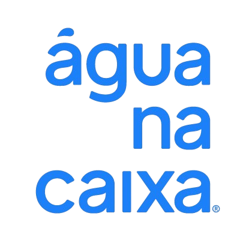

<p align="center">
  
</p>

<h1 align="center">Painel Administrativo</h1>

Este é o painel administrativo para a Agua na Caixa. Este painel é construído na arquitetura monolítica do Rails 7.1.3 e usa Ruby 3.2.2 como linguagem de programação. Ele também faz uso de recursos do Hotwire para uma experiência de usuário interativa e responsiva.

## Requisitos

Certifique-se de ter as seguintes dependências instaladas antes de executar o projeto:

- Ruby 3.2.2
- Rails 7.1.3
- Docker e Docker Compose

## Configuração e Execução com Docker

Siga estas etapas para configurar e executar o projeto localmente usando Docker:

1. Clone este repositório em sua máquina local:

    ```bash
    git clone https://github.com/seu-usuario/agua_na_caixa_panel.git
    ```

2. Navegue até o diretório do projeto:

    ```bash
    cd agua_na_caixa_panel
    ```

3. Construa a imagem Docker:

    ```bash
    docker build --network=host -t web .
    ```

4. Execute o contêiner Docker:

    ```bash
    docker-compose up --build -d
    ```

Acesse o painel administrativo em seu navegador da web:

```bash
http://localhost:3000
